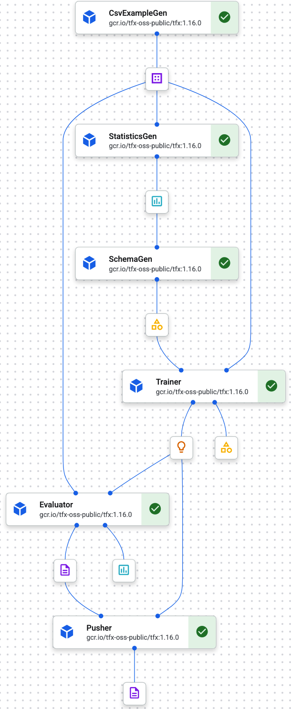

# insider-ml-test

O pipeline foi construído usando tensorflow extended (tfx), uma biblioteca open source focada na criação e gerenciamento de pipelines de machine learning. O tfx faz parte do ecossistema tensorflow e é focada em ambientes de produção.

O tfx faz parte do ecossistema tensorflow e possui integração com o google cloud platform.
Tfx possui integração com Kubeflow pipeline, de modo que o json exportado pode ser utilizado em ambos.

Para executar o pipeline, execute:

`pip install -r requirements.txt`

`python main.py`

Os elementos utilizados na criação do pipeline foram:

* **CSVExampleGen**: recebe o CSV com os dados e transforma em TFRecords;
* **StatisticsGen**: gera algumas estatísticas sobre o dataset;
* **SchemaGen**: cria um "esquema" de valores, que é utilizado pelo Trainer;
* **Trainer**: inicializa o treinamento no Vertex AI Training no Google Cloud Platform;
* **Pusher**: faz upload do modelo no Vertex AI Prediction.

Processamento dos dados
=================================================

A primeira etapa foi remover os usuários da planilha que não possuam idade, e renomeia o sexo pars 1 - masculo e 0 feminino
Em seguida o componente CSVExampleGen recebe o csv e o transforma em TFRecords
StaticsGe gere algumas estatísticas sobre o dataset e SchemGen gera ..

Modelagem e treinamento
=================================================

Após a geração da base de dados, o componente Trainer recebe o modelo, parâmetros e configurações e realiza o treinamento no Vertex AI

Pusher
=================================================

O componente exporta o modelo savo no formato SavedModel e faz um deploy no Vertex Ai Prediction.

Para monitoramento do modelo, utilizei o TensorBoard que está integrado a aba de Experimentos do vertex ai.

*[Verifique o TensorBoard do treinamento. ](https://us-central1.tensorboard.googleusercontent.com/experiment/projects+913507232607+locations+us-central1+tensorboards+6450522458859503616+experiments+3715416520885534720/#scalars)*

O endpoint do modelo está publico e é possível fazer uma inferência executando:

`python inference.py`

INPUTS: 'pclass','age', 'parch', 'fare', 'sex'
OUTPUTS: sobreviveu, nao-sobrevibeu

Configurações da máquida de uso:
OS: Ubuntu 22.4LTS
Processador: Inter Core I5